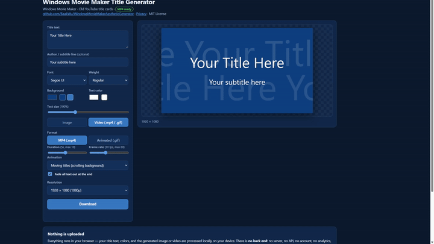

# Windows Movie Maker Title Generator



A **vanilla JavaScript web app** that recreates the old Windows Movie Maker /
early-YouTube era opening title card: big centered text on a solid background,
with the classic "moving titles" effect (a translucent copy of your title
scrolling across the background) and optional fade-in / fade-out.

- **Use it:** open [`index.html`](index.html) — no server, no build step, no uploads.
- **No server. No upload.** Everything runs in your browser:
  - Image mode: the title card is drawn on a `<canvas>`.
    - Video mode: the animation is rendered frame-by-frame and encoded on your
    machine. `.mp4` uses WebCodecs + [Mediabunny](https://github.com/mediabunny/mediabunny)
    (Chrome/Edge required); animated `.gif` uses
    [gifenc](https://github.com/mattdesl/gifenc). Both encoder libraries are
    loaded from a CDN at runtime.

## Usage

1. Open `index.html` (double-click), or deploy it as static files (see
   [Deploying](#deploying-cloudflare-pages)).
2. Enter a title (and optional subtitle line), pick font, colors, and size.
3. Choose the output mode:
   - **Image** — exports a single PNG (lossless) or JPEG.
    - **Video** — .mp4 or animated .gif, 1–10 s, 10–60 fps, with an animation:
     - *None* — static card.
     - *Title fly-in* — text flies in from one of 8 directions.
     - *Moving titles* — scrolling translucent background title (the Movie
       Maker look), with an optional fade-out of all text at the end.
4. Pick a resolution (16:9 widescreen presets, 4:3 standard presets, or custom).
5. A live preview renders automatically; click **Download** to save your
   `.png` / `.jpg` / `.mp4`.

## Deploying (Cloudflare Pages)

This repo ships a [`wrangler.json`](wrangler.json) configured for Cloudflare
Pages (assets-only, directory `.`):

```
npx wrangler login        # first time only
npx wrangler deploy       # from the repo root
```

Or connect the repo to a Cloudflare Pages project with the build command
`wrangler deploy` (or no build at all — it's fully static).

## Privacy

- No backend, no analytics, no cookies, no tracking.
- Rendering, encoding, and file downloads happen client-side.
- The page makes only third-party fetches for the encoder libraries at runtime:
  `Mediabunny` (MP4 output) and `gifenc` (GIF output), both from
  `cdn.jsdelivr.net`. Image mode works fully offline.

## Project layout

| File | Purpose |
| --- | --- |
| `index.html` | UI markup |
| `app.js` | state, rendering, preview, image + MP4/GIF export |
| `styles.css` | styling |
| `assets/demo.gif` | README demo GIF |
| `assets/screenshot.png` | still screenshot (fallback) |
| `wrangler.json` | Cloudflare Pages deployment config |

## License

Released under the [MIT License](LICENSE). Copyright © 2026 BaakWu.
